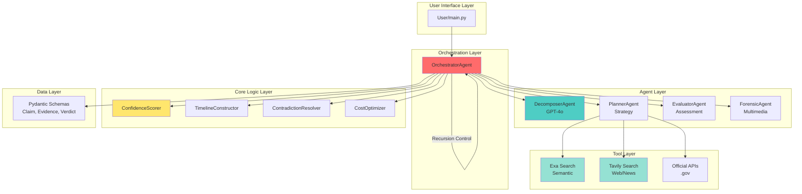
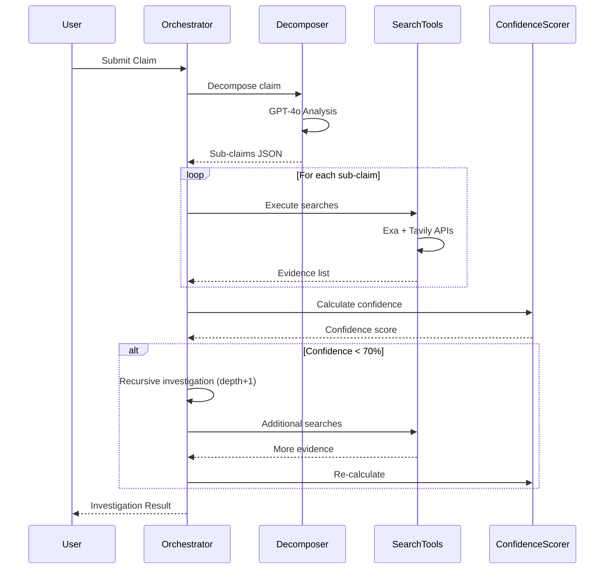
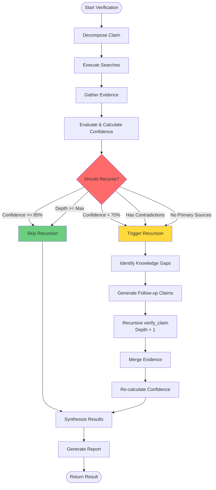
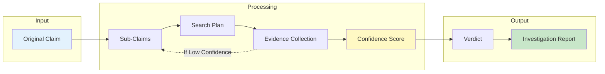
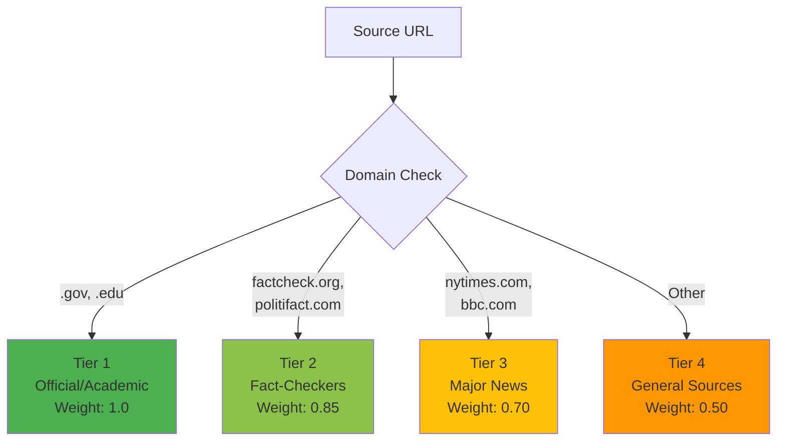
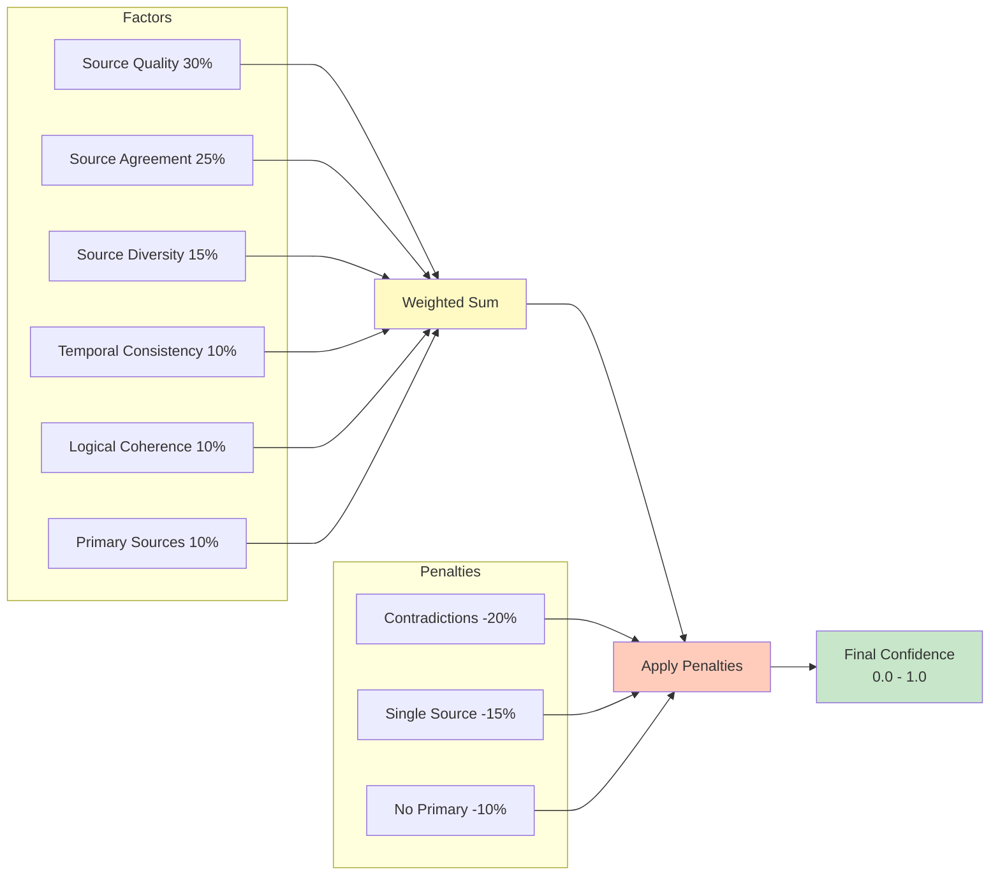

# System Architecture Diagram

## Overall System Architecture



## Verification Workflow



## Recursion Decision Flow



## Data Flow



## Source Tier Classification



## Confidence Calculation



## Component Interaction Matrix

```
┌─────────────────┬──────────┬──────────┬──────────┬──────────┐
│                 │ Decomp   │ Planner  │ Evaluator│ Forensic │
├─────────────────┼──────────┼──────────┼──────────┼──────────┤
│ Orchestrator    │    ✓     │    ✓     │    ✓     │    ✓     │
│ SearchTools     │    ✗     │    ✓     │    ✗     │    ✗     │
│ ConfidenceScorer│    ✗     │    ✗     │    ✓     │    ✗     │
│ TimelineBuilder │    ✗     │    ✗     │    ✓     │    ✗     │
│ CostOptimizer   │    ✗     │    ✓     │    ✗     │    ✗     │
└─────────────────┴──────────┴──────────┴──────────┴──────────┘

Legend: ✓ = Direct interaction, ✗ = No direct interaction
```
